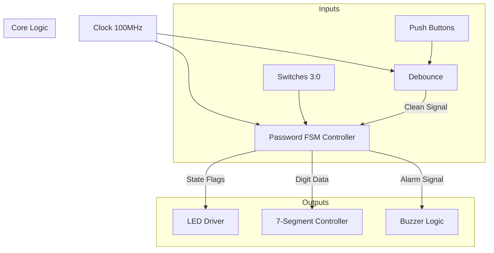

# 🔐 FPGA-Based Digital Security System
[](https://en.wikipedia.org/wiki/Verilog)
[](https://www.xilinx.com/products/silicon-devices/fpga/artix-7.html)
[](https://digilent.com/shop/nexys-a7-fpga-trainer-board-recommended-for-ece-curriculum/)
[](https://www.xilinx.com/products/design-tools/vivado.html)

A robust, hardware-accelerated password security system implemented on the **Nexys A7-100T FPGA**.
Unlike software-based microcontrollers, this project utilizes **Parallel Processing** and a custom **Finite State Machine (FSM)** to ensure zero-latency response times and "hardened" security against software vulnerabilities.

---

## 📌 Project Overview
This system implements a dynamic digital lock that mimics real-world security protocols. It features a two-digit decimal authentication scheme, a secure password reset protocol, and a hardware "kill switch" for immediate system overrides. The design leverages the **Artix-7 FPGA** to handle concurrent logic operations, ensuring reliable timing for debounce logic and acoustic alarm generation.

---

## ✨ Key Features
* **🔒 Dynamic Reconfigurability:** Users can change their password at runtime without reprogramming the board.
* **🛡️ Secure Reset Protocol:** Changing the password requires proving identity by entering the *old* password first.
* **⚡ Zero-Latency Response:** Uses FPGA combinational logic for instant state transitions.
* **🔊 Multi-Sensory Feedback:**
    * **Visual:** 7-Segment display for input tracking and LED patterns for state indication.
    * **Auditory:** 1 kHz Buzzer alarm for unauthorized access attempts.
* **🛑 Hardware Kill Switch:** A dedicated master switch (`SW[15]`) to instantly reset/override the alarm state.

---

## 🛠️ Hardware & Software Requirements
| Component | Specification |
| :--- | :--- |
| **Development Board** | Digilent Nexys A7-100T |
| **FPGA Chip** | Xilinx Artix-7 |
| **Language** | Verilog HDL |
| **IDE** | Xilinx Vivado Design Suite |
| **Clock Frequency** | 100 MHz |

---

## 📐 System Architecture

The design is modular, consisting of three primary sub-modules integrated into a top-level wrapper.

### Block Diagram


## Module Descriptions:
* **Debounce Module:** Uses a counter-based filter to remove mechanical noise from button presses, ensuring stable single-cycle pulses.
* **Password FSM (Core):** The "brain" of the system. It manages the states (Idle, Verify, Alarm, Reset) and stores the password in registers.
* **7-Segment Controller:** A time-multiplexed driver that visualizes the user's input in real-time

## 🎮 Controls & Pin Mapping

### **Switches (Data Input)**
| Component | Function |
| :--- | :--- |
| **SW[3:0]** | Input for 4-bit binary digits (0-9) |
| **SW[15]** | **Master Kill Switch** (System Override/Reset) |

### **Buttons (Control Logic)**
| Button | Function |
| :--- | :--- |
| **BtnC (Center)** | **ENTER:** Latch the current digit from switches |
| **BtnU (Up)** | **CONFIRM:** Submit the two-digit code for verification |
| **BtnL (Left)** | **RESET REQ:** Request to change password (requires old password) |
| **BtnR (Right)** | **SAVE:** Confirm and save the *new* password |

---

## 🔄 Finite State Machine (FSM) Logic

[cite_start]The system is governed by a robust Mealy/Moore hybrid FSM[cite: 30].

* **IDLE:** System waits for input. (Status: Single LED ON) [cite_start][cite: 14, 95]
* [cite_start]**ENTER_DIGIT:** User inputs digits via `SW[3:0]` and presses `BtnC` to latch them. [cite: 37, 40]
* [cite_start]**VERIFY:** System compares input vs. stored password. [cite: 98]
    * [cite_start]*Match:* Go to **UNLOCK** (Solid LEDs). [cite: 99]
    * [cite_start]*Mismatch:* Go to **ALARM** (Blinking LEDs + Buzzer). [cite: 99, 100]
* **RESET_OLD:** User requested a password change. [cite_start]Must enter current password to proceed. [cite: 102]
* [cite_start]**RESET_NEW:** If old password was correct, user enters new digits and presses `BtnR` to **SAVE**. [cite: 103]

---

## 🚀 How to Run

1.  **Clone the Repository:**
    ```bash
    git clone [https://github.com/YourUsername/FPGA-Security-System.git](https://github.com/YourUsername/FPGA-Security-System.git)
    ```

2.  **Open in Vivado:**
    * [cite_start]Launch Xilinx Vivado. [cite: 13]
    * [cite_start]Create a new project and select **Nexys A7-100T** as the target board. [cite: 13]
    * Add the `.v` source files (top, fsm, debounce, display) and the `.xdc` constraint file.

3.  **Synthesize & Implement:**
    * Click **Run Synthesis** -> **Run Implementation** -> **Generate Bitstream**.

4.  **Program Device:**
    * Connect the Nexys A7 via USB.
    * Open Hardware Manager -> **Auto Connect** -> **Program Device**.

5.  **Test:**
    * [cite_start]Default Password is **42**[cite: 49].
    * Set switches to `0100` (4), press `BtnC`.
    * Set to `0010` (2), press `BtnC`.
    * Press `BtnU` to unlock!
