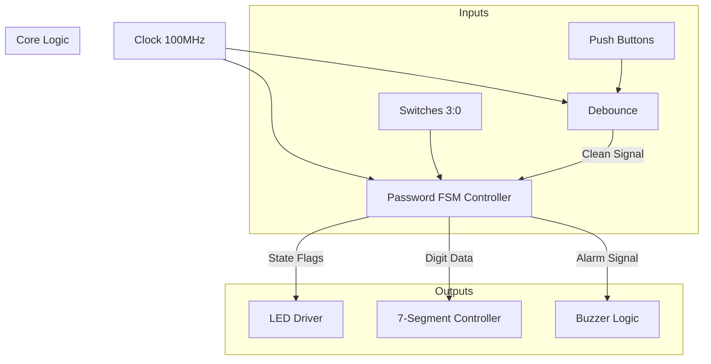

# 🔐 FPGA-Based Digital Security System

A robust, hardware-accelerated password security system implemented on the **Nexys A7-100T FPGA**.
Unlike software-based microcontrollers, this project utilizes **Parallel Processing** and a custom **Finite State Machine (FSM)** to ensure zero-latency response times and "hardened" security against software vulnerabilities.

---

## 📌 Project Overview
This system implements a dynamic digital lock that mimics real-world security protocols. It features a two-digit decimal authentication scheme, a secure password reset protocol, and a hardware "kill switch" for immediate system overrides. The design leverages the **Artix-7 FPGA** to handle concurrent logic operations, ensuring reliable timing for debounce logic and acoustic alarm generation.

---

## ✨ Key Features
* **🔒 Dynamic Reconfigurability:** Users can change their password at runtime without reprogramming the board.
* **🛡️ Secure Reset Protocol:** Changing the password requires proving identity by entering the *old* password first.
* **⚡ Zero-Latency Response:** Uses FPGA combinational logic for instant state transitions.
* **🔊 Multi-Sensory Feedback:**
    * **Visual:** 7-Segment display for input tracking and LED patterns for state indication.
    * **Auditory:** 1 kHz Buzzer alarm for unauthorized access attempts.
* **🛑 Hardware Kill Switch:** A dedicated master switch (`SW[15]`) to instantly reset/override the alarm state.

---

## 🛠️ Hardware & Software Requirements
| Component | Specification |
| :--- | :--- |
| **Development Board** | Digilent Nexys A7-100T |
| **FPGA Chip** | Xilinx Artix-7 |
| **Language** | Verilog HDL |
| **IDE** | Xilinx Vivado Design Suite |
| **Clock Frequency** | 100 MHz |

---

## 📐 System Architecture

The design is modular, consisting of three primary sub-modules integrated into a top-level wrapper.

### Block Diagram

## Module Descriptions:
* **Debounce Module:** Uses a counter-based filter to remove mechanical noise from button presses, ensuring stable single-cycle pulses.
* **Password FSM (Core):** The "brain" of the system. It manages the states (Idle, Verify, Alarm, Reset) and stores the password in registers.
* **7-Segment Controller:** A time-multiplexed driver that visualizes the user's input in real-time

